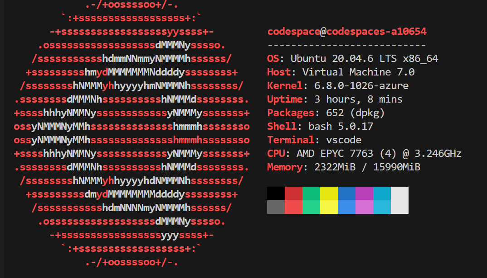
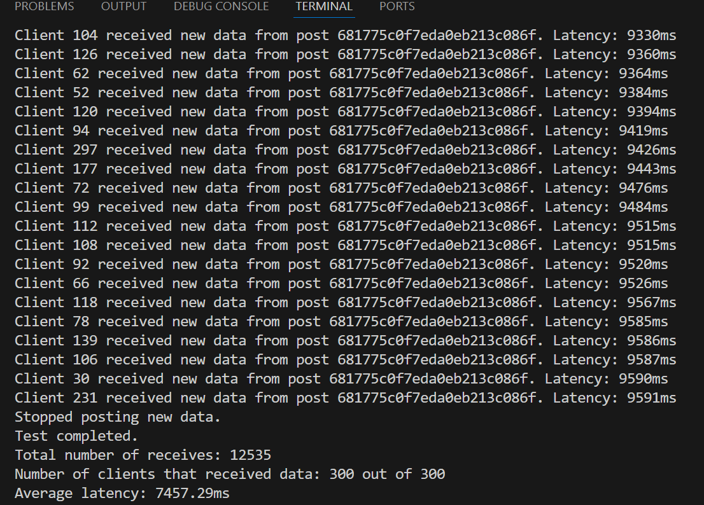
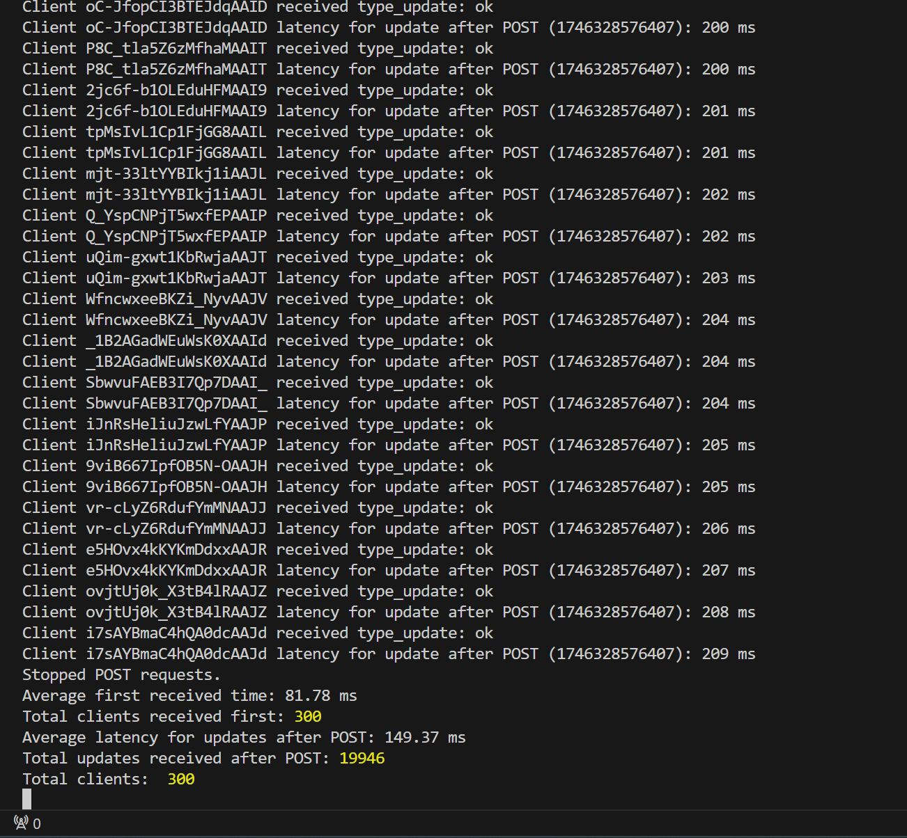
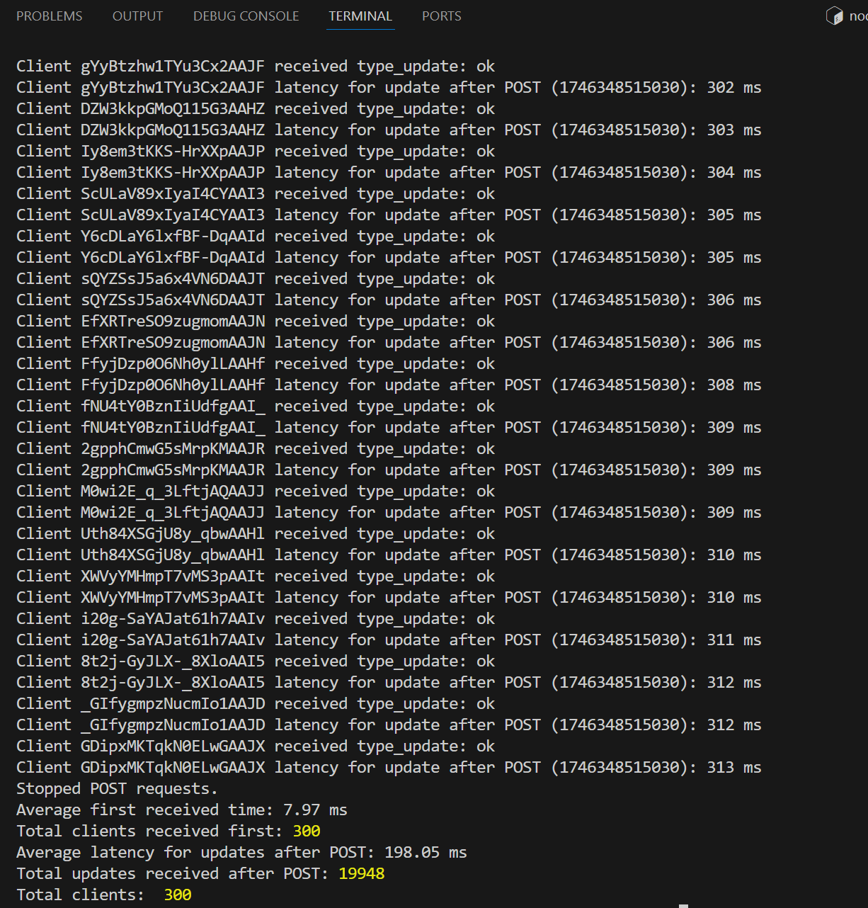
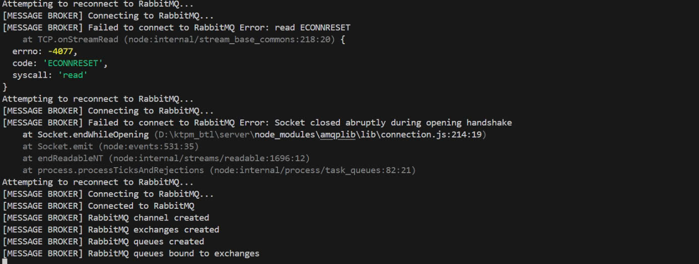
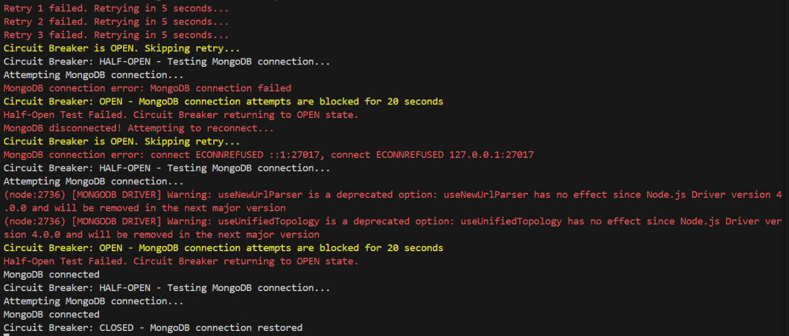

# Report KTPM
## **Setup**
1. Server

cd server

docker-compose up -d --build

Thiết lập file .env từ .env.example

npm install

node import_data.js

npm run dev

2. Client

cd client

npm install

npm run dev

## **Mô tả db**

1. MarketData
   - dataType: Loại dữ liệu. Có 15 loại, chia làm 3 topics:
     - Currencies: EUR_USD, GBP_USD, USD_VND, BTC_USD, ETH_USD
     - Energy: Brent, WTI, Gasoline RBOB, Gas, Heating Oil
     - Metals: Gold, Silver, Copper, SJC, PNJ
   - dataPrice: Giá tiền (USD)
   - timestamp: Thời gian giá được ghi nhận

## **Mô tả các API**

1. /market-data
   - Method: POST
   - Thêm object vào db
   - Params:
     - dataType
     - dataPrice
     - timestamp
2. /market-data

   - Method: GET
   - Lấy các object theo ngày gần nhất với query
   - Query: Mặc định hoặc thiếu 1 trong 3 params là lấy ngày hiện tại
     - day: Ngày
     - month: Tháng
     - year: Năm

3. /market-data/:id
   - Method: DELETE
   - Xóa object bằng id
   - Params:
     - id: id của object

## **Mô tả giao diện client**

## **Các thuộc tính chất lượng - Các vấn đề liên quan - các pattern đã áp dụng để cải thiện**

1. Performance
- Vấn đề 1: Kiến trúc ban đầu yêu cầu client phải chủ động gửi yêu cầu (poll) đến server định kỳ (mỗi 2 giây) để kiểm tra và lấy dữ liệu giá vàng mới nhất. Điều này dẫn đến độ trễ đáng kể từ thời điểm giá thay đổi trên server đến khi client nhận được, không đáp ứng yêu cầu cập nhật tức thời (real-time). Đồng thời, việc polling liên tục tạo ra lưu lượng mạng và tải xử lý không cần thiết trên cả client, server và database ngay cả khi không có dữ liệu mới.
-> Áp dụng pattern publisher/Subcriber: Khi có sự thay đổi về giá vàng, thay vì chờ client hỏi, Publisher là server chủ động gửi (publish) một tin nhắn chứa thông tin giá mới đến message broker là RabbitMQ, đồng thời cập nhật vào database. Message broker lúc này đóng vai trò trung gian, đưa các tin nhắn đến các socket đang lắng nghe đến các topic tương ứng. Với mỗi client sẽ có một socket (sử dụng socket.io client) để subscribe đến các topic là các queue trên rabbitMQ.
=> Với việc áp dụng này:
+ các client duy trì kết nối, lắng nghe server và khi có thay đổi thì ngay lập tức nhận được dữ liệu mới đã thay đổi nếu là topic đã subcribe để đảm bảo real-time
+ Publisher là server không cần quản lý các clients truy cập từ đó có thời gian post một cách liên tục; database không nhận lượng truy vấn lớn, clients và server không phải xử lý khi không có sự thay đổi được post.

- Vấn đề 2: Khi đã cài đặt xong pattern publisher/subcriber và các socket để kết nối giữa người dùng luôn lắng nghe các sự kiện thì tồn tại 1 vấn đề là khi một client mới kết nối hoặc subscribe vào một chủ đề giá vàng, client đó cần hiển thị giá trị hiện tại ngay lập tức, thay vì phải chờ đợi lần cập nhật tiếp theo từ Publisher (có thể mất vài giây).
-> Áp dụng pattern cache aside: xây dựng một cache của database bằng Redis, các data về các chủ đề hot nhiều người truy cập sẽ được lưu vào trong cache; khi post thông tin mới thì data sẽ được cập nhật ở cả database và cache.
=> Với việc áp dụng này khi clients mới subcribe thì sẽ nhận được giá gần nhất của topic một cách nhanh nhất thông qua cache nếu chủ đề đó đang hot và đã được lưu vào cache.

2. Scalibility
- Vấn đề 3: Trong kiến trúc polling, với số lượng lớn client cùng truy vấn định kỳ (mỗi 2s), Database ( MongoDB) phải xử lý một lượng lớn yêu cầu đọc đồng thời, dễ dẫn đến quá tải, giảm hiệu năng và có nguy cơ sập. Server cũng phải tốn tài nguyên để xử lý hàng loạt request HTTP và truy vấn DB này.
-> Áp dụng pattern publisher/subcriber: cách áp dụng đã trình bày ở vấn đề 1
=> Với việc áp dụng trên thì:
+ đã loại bỏ hoàn toàn các truy vấn DB từ phía client polling. Yêu cầu đến databse chỉ còn là ghi DB đến từ Publisher là server khi có giá mới.
+ Server không còn phải xử lý hàng nghìn request HTTP polling, giải phóng tài nguyên CPU, memory
+ Dễ dàng tăng số lượng clients bằng việc cải tiến thành phần trung gian như là message broker mà không cần nâng cấp database hay publisher là server.

- Vấn đề 4: Việc truyền dữ liệu cho từng socket do rabbitMQ xử lý, tuy nhiên khi số lượng post của server diễn ra một cách liên tục vào thời điểm cao điểm, và số socket lớn thì rabbitMQ bị quá tải hoặc không kịp xử lý, đặc biết là những thời điểm nóng gây tắc nghẽn có thể dẫn đến sập rabbitMQ, socket không thể gửi thông tin như bình thường thì một số yêu cầu sẽ bị miss nếu không lưu lại để xử lý dần.
-> Áp dụng pattern Queue-Based Load Leveling: để tạo một hàng đợi xử lý lần lượt các yêu cầu post từ server, Queue được cài đặt bằng rabbitMQ, khi không có socket nào sẵn sàng nhận được thông tin thì message vẫn được lưu trong queue.
=> Với việc áp dụng trên thì: dù các yêu cầu của server có thể liên tục gửi đến rabbitMQ, nhiều socket đăng ký các topic của rabbitMQ thì sẽ tránh sự tắc nghẽn dẫn đến một số yêu cầu bị miss không thực hiện được.

3. Avaiability
- Vấn đề 5: Trong quá trình hoạt động, các kết nối mạng đến Database hoặc RabbitMQ có thể gặp lỗi tạm thời (transient failures) như mất gói tin, timeout ngắn, dịch vụ tạm thời không phản hồi do tải cao đột ngột. Nếu không xử lý, các lỗi này sẽ làm gián đoạn luồng cập nhật dữ liệu.
-> Áp dụng pattern Retry: trước hết xác định các kết nối quan trọng là kết nối đến database và rabbitMQ của server;  Bọc các thao tác này trong một logic thử lại, khi thao tác thất bại với một lỗi được xác định là có thể thử lại ( TimeoutError, ConnectionError) thì sẽ thực hiện chờ 3s sau đó thực hiện lại thao tác; kết thúc sau 3 lần gọi retry.
=> Với việc áp dụng trên thì tăng tỉ lệ thành công khi database hay rabbitMQ gặp những lỗi có thể khắc phục sau khoảng thời gian ngắn thì sau một vài lần retry server sẽ tiếp tục hoạt động như bình thường và thực hiện các yêu cầu để gửi thông tin cho các clients.

- Vấn đề 6: Việc sử dụng Retry pattern giúp cho server kết nối được với các thành phần bị lỗi sau các lần thử kết nối lại, tuy nhiên server còn phải thực hiện nhiều nhiệm vụ khác để đảm bảo các tính năng khác của hệ thống nên khi các thành phần này lỗi cần thời gian phục hồi lâu thì việc retry nhiều lần liên tục là không cần thiết và khiến server nhiều việc hơn.
-> Áp dụng pattern Circuit Breaker: 
+ Closed (Mạch đóng - Trạng thái bình thường): Các yêu cầu được phép đi qua (thực hiện Retry 3 lần nếu lỗi).
+ Open (Mạch mở): Nếu thất bại 3 lần retry liên tiếp thất bại, Circuit Breaker sẽ "mở mạch". Mọi yêu cầu tiếp theo đến thao tác này sẽ bị từ chối ngay lập tức mà không cần thực hiện thao tác gọi database. Circuit Breaker duy trì trạng thái này trong một khoảng thời gian chờ là 20 giây.
+ Half-Open (Nửa mở): Sau thời gian chờ ở trạng thái Open, Circuit Breaker chuyển sang Half-Open. Nó cho phép 1 lần thử thao tác kết nối để thử nghiệm xem dịch vụ phụ thuộc đã phục hồi chưa. Nếu yêu cầu thử nghiệm thành công thì chuyển về Closed. Nếu yêu cầu thử nghiệm thất bại thì quay lại trạng thái Open và bắt đầu lại thời gian chờ.
=> Với việc áp dụng trên thì server sẽ không phải thực hiện các hành động không có kết quả khi dịch vụ khác như database cần nhiều thời gian để phục hồi, tránh lãng phí tài nguyên vô ích.

## **Tổng quan kiến trúc của hệ thống**

                         +------------+     +------------+     +------------+
                         |  Client 1  |     |  Client 2  | ... |  Client 3  |
                         +------------+     +------------+     +------------+
                               ▲                   ▲                  ▲
                               │                   │                  │
                               │                   │                  │
                      +----------------+   +----------------+   +----------------+
                      | Subscriber 1   |   |  Subscriber 2  |...| Subscriber M   |
                      |socket.io client|   |socket.io client|   |socket.io client|
                      +----------------+   +----------------+   +----------------+
                               ▲                   ▲                  ▲
                             queue               queue              queue
                            (topic1)            (topic2)           (topicM)
                               ▲                   ▲                  ▲
                            +-----------------------------------------------+
                            |                   RabbitMQ                    |
                            |                (Message broker)               | 
                            |                 Message Queue                 |
                            +-----------------------------------------------+
                                                   ▲
                                          Retry    │   publish              
                                                   │                  
                            +-----------------------------------------------+
                            |                    Server                     |
                            |                  (publisher)                  |
                            +-----------------------------------------------+
                             Retry  │  write                write   │ query when 
                     Circuit Broker │                               │ subcribe
                                    ▼                               ▼ 
                           +----------------+               +----------------+   
                           |    Database    |               |     Cache      |
                           |    (mongoDB)   |               |    (Redis)     |   
                           +----------------+               +----------------+   

## **Thực nghiệm**
1. Setup
Để thực nghiệm một cách khách quan, chạy server và các thành phần liên quan của hệ thống và các giả lập clients trên 2 máy ảo khác nhau tạo bởi codespace:
+ Server, Database, rabbitMQ, Cache: 4 core - 16GB RAM - 32GB.
+ Clients: 2 core - 8GB RAM - 32GB.

2. Kịch bản và kết quả thực nghiệm.
- Hệ thống cũ: 
+ Một old_server có các api giống với api ban đầu của project và có kết nối với mongoDB không cài thêm pattern nào.
+ Kịch bản kiểm thử 1: Chạy giả lập tạo 300 clients để request đến server; cứ 1s lại tạo 1 client mới;  server sẽ thực hiện post dữ liệu mới 5s một lần; client sau khi được tạo thì 2s lại poll thông tin từ server về 1 lần; các thông tin đo sau khi 8p thực nghiệm kết thúc: trung bình độ trễ của các lần nhận được dữ liệu mới kể từ lần post gần nhất từ khi thực hiện request, số lượng response mà các clients nhận được, số lượng clients.
+ kết quả thực nghiệm cho kịch bản 1:

+ kịch bản kiểm thử 2: tương tự như kịch bản 1 tuy nhiên cài tạo ra các lỗi khiến cho Database không hoạt động.
+ Kết quả thực nghiệm cho kịch bản 2: server dừng lại do không có cơ chế khắc phục như Retry hay Circuit Broker kể cả khi Database được phục hồi.

- Hệ thống mới:
+ Hệ thống cài đầy đủ các pattern đã trình bày và theo kiến trúc đã vẽ trong phần tổng quan.

+ Kịch bản kiểm thử 1: tương tự như hệ thống cũ, sẽ tiến hành giả lập 300 clients tuy nhiên được cài socket.io client để subcribe với message broker; Cứ 1s lại tạo thêm 1 client mới subcribe vào các topic; Cứ 5s thì server sẽ post hay publish dữ liệu mới; các thông tin đo được khi 8p thực nghiệm kết thúc: Trung bình đỗ trễ kể từ khi dữ liệu được post đến khi các subcribers nhận được dữ liệu đó, độ trể kể từ khi lần đầu clients đó subcribe đến khi nhận được thông tin hiện tại lần đầu tiên, số lần nhận dữ liệu của các clients, số lượng clients đã subcribe.
+ kết quả thực nghiệm cho kịch bản 1 khi chưa dùng Cache-aside:

+ kết quả thực nghiệm cho kịch bản 1 khi đã dùng Cache-aside:

+ Kịch bản kiểm thử 2: Tương tự như hệ thống cũ tuy nhiên sẽ tạo ra các lỗi khiến cho database và rabbitMQ để xem phản ứng của hệ thống.

+ Kết quả thực nghiệm cho kịch bản 2 cho thấy tác dụng của Retry Patter:

+ Kết quả thực nghiệm cho kịch bản 2 cho thấy tác dụng của Circuit broker:

3. Nhận xét về các pattern đã được áp dụng dựa trên kết quả thực nghiệm
- Về kết quả của thực nghiệm 1 cho thấy: 
+ về performance: 
* Có thể thấy sau khi sử dụng socket.io và message broker là RabbitMQ của pattern publisher và subcriber thì độ trễ trung bình của các clients kể từ lúc có dữ liệu mới đến khi nhận được là từ 150ms đến 198ms so với 7s ở phía hệ thống cũ.
* Có thể thấy được sau khi sử dụng Cache-aside thì thời gian trung bình các clients vừa subcribe thành công và nhận được dữ liệu hiện tại là 8ms so với 82ms khi không sử dụng Cache-aside
+ về scalability: Có thể thấy trong cùng một khoảng thời gian và số lượng client thì số lượng dữ liệu mới gửi kịp thời cho các clients trong hệ thống mới là gần 19948 và 19946 tiệm cận số yêu cầu nhận được lý tưởng là 19950 (do chạy trong 8p, 5s post 1 lần, 0->300 clients mỗi giây thêm 1 clients) so với 12535 dữ liệu nhận được của các client ở hệ thống cũ ( có những client không nhận đủ response). Điều này là do pattern Queue-Based Load Leveling giúp đảm bảo không bị mất các message từ các lần post cũng như việc thực hiện pattern publisher/subcriber khiến cho server cũng như database không bị quá tải khi có quá nhiều clients. Khi thực nghiệm trên hệ thống cũ tài nguyên Cpu và ram tốn hơn rõ rệt so với hệ thống mới, đôi khi database có thể sập do quá nhiều truy vấn.

- Về kết quả của thực nghiệm 2 cho thấy:
+ về avaiablility: Hệ thống cũ ngừng hoạt động không phục hồi khi có lỗi xảy ra đến các thành phần liên quan bị lỗi, ngay cả khi các thành phần phục hồi sau đó.
* Có thể thấy sau khi rabbitMQ bị lỗi về từ chối phục vụ server trong một khảng thời gian ngắn, server đã tiến hành kết nối lại với rabbitMQ vài lần sau mỗi 5s và đã thành công kết nối lại, hệ thống hoạt động bình thường.
* có thể thấy sau khi MongoDB bị lỗi trong một khoảng thời gian khá dài thì ban đầu server thực hiện retry 3 lần tuy nhiên đều thất bại lúc này Circuit Broker chuyển sang trạng thái mở mạch (Open) và không thử kết nối lại trong vòng 20s. Khi kết thúc 20s Circuit Broker chuyển sang trạng thái nửa mở mạch (Half-open) để thử kết nối lại một lần nếu thật bại sẽ lại quay về Open. Sau một khoảng thời gian chuyển đổi giữa các trạng thái Open và Half-open thì Mongo phục hồi Half-open thành công kết nối với Circuit Broker chuyển sang trạng thái đóng mạch (close), hệ thống sau đó hoạt động bình thường.